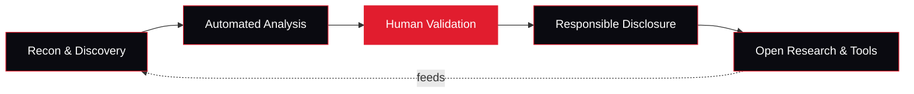

 

### Automate the attack surface. Open the knowledge.

**An open-source cybersecurity organization, built in Egypt for the global security community.**

 

 

[**The Mission**](#-the-mission) &nbsp;•&nbsp; [**Platform**](#-how-it-works) &nbsp;•&nbsp; [**Toolkit**](#-the-toolkit) &nbsp;•&nbsp; [**Research**](#-research) &nbsp;•&nbsp; [**Academy**](#-academy) &nbsp;•&nbsp; [**Roadmap**](#-roadmap) &nbsp;•&nbsp; [**Contribute**](#-contribute)

---

## 🔺 The Mission

PyramidSec is a **non-profit, student-led, open-source cybersecurity initiative**. We build practical offensive and defensive security automation, publish the research behind it, and train the next generation of Egyptian and Arab security researchers.

> **Security should be automated where machines are fast, and validated where humans are sharp.**

We focus on the problems that decide real assessments:

| | |
|---|---|
| 🌐 **Web and API security** | Authentication, authorization, access control, injection, business logic |
| 🤖 **AI and LLM security** | Prompt injection, tool abuse, agent trust boundaries, secret handling |
| 📦 **Container and cloud** | Project isolation, misconfigurations, exposed services |
| 🔍 **Reconnaissance** | Attack surface discovery, parameter and endpoint analysis |

---

## ⚙️ How it works

Every PyramidSec project follows one principle: **automate discovery, validate manually, publish openly.**

---

## 🧰 The Toolkit

Our target is **25+ open-source security tools** across six pillars. Status updates as each tool ships.

| Pillar | What we are building | Status |
|---|---|---|
| 🔍 **Recon and Discovery** | Subdomain, parameter, and endpoint enumeration | 🟡 In development |
| 🌐 **Web and API Testing** | Access control, injection, auth flaws, CORS and header checks | 🟡 In development |
| 🤖 **AI and LLM Security** | Prompt injection, tool abuse, agent boundary testing | 🔵 Planned |
| 🔐 **Code and Secrets** | Secure code review helpers, secret detection | 🔵 Planned |
| 📦 **Container and Cloud** | Isolation checks, misconfiguration auditing | 🔵 Planned |
| 🧪 **Learning Labs** | Intentionally vulnerable apps for hands-on practice | 🟡 In development |

> 📌 Each repository carries its own license. See the `LICENSE` file in each project.

---

## 🔬 Research

We publish **only after responsible disclosure is complete**.

- **Vulnerability research** with reproduction steps, impact analysis, and fixes
- **Architecture and trust-boundary reviews** of open-source platforms
- **AI agent security** research: tool permissions, isolation, and secret handling
- **CTF write-ups** covering web exploitation, cryptography, reverse engineering, and forensics

---

## 🎓 Academy

Knowledge belongs to everyone. The PyramidSec Academy offers:

| Track | For | What you get |
|---|---|---|
| 🌱 **Foundations** | Beginners | Networking, Linux, web basics, first CTF challenges |
| ⚔️ **Offensive Security** | Intermediate | Web exploitation, API testing, bug bounty methodology |
| 🛡️ **Secure Engineering** | Developers | Secure code review, threat modeling, defensive design |
| 🏆 **Competitor Track** | Advanced | CTF preparation, team practice, research projects |

**Weekly hands-on challenges** run on intentionally vulnerable applications, with write-ups and mentoring for every level.

---

## 🗺️ Roadmap

- [x] Establish the organization and mission
- [ ] Publish the first open-source tools
- [ ] Launch the Academy learning paths
- [ ] Release the vulnerable labs collection
- [ ] Run the first PyramidSec CTF
- [ ] Reach 10 open-source projects
- [ ] Reach 25+ open-source tools
- [ ] Publish the first research reports
- [ ] Open contributor onboarding and a mentorship program

---

## 🏛️ Principles

| | |
|---|---|
| **Practical first** | Tools and labs built from real testing experience |
| **Open by default** | Every project is open source, with a clear license |
| **Responsible always** | Disclose first, publish after the fix |
| **Beginner friendly** | Everyone starts somewhere, and we help people start |
| **Student led** | Built by students, for students and professionals alike |

---

## 🤝 Contribute

We welcome tool ideas, bug reports, write-ups, labs, and pull requests.

1. 🔎 Browse our repositories and open an issue to discuss your idea
2. 🍴 Fork the repository and build your change
3. 📬 Submit a pull request following the project's `CONTRIBUTING.md`

New to open source? Look for issues labeled **`good first issue`**.

---

## 🛡️ Responsible Disclosure

Found a vulnerability in one of our projects? Please contact us privately at **[your-email@domain]** before disclosing publicly. We acknowledge reports and credit researchers who report in good faith.

> Our tools are for **authorized security testing and education only**. Use them only on systems you own or have explicit permission to test.

---

### 🔺 PyramidSec

**Secure the future, one open-source tool at a time.**

 

[GitHub](https://github.com/pyramidsec) &nbsp;•&nbsp; [LinkedIn](#) &nbsp;•&nbsp; [X](#) &nbsp;•&nbsp; [Contact](#)

Non-profit • Student-led • Open-source cybersecurity

